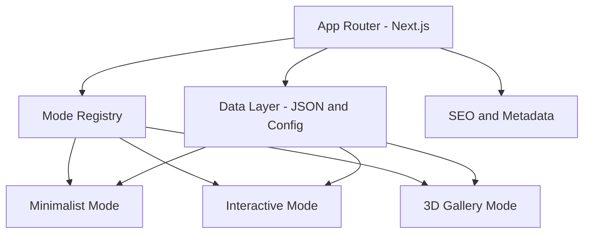

# WebsiteCV

Interactive CV and portfolio platform built with Next.js, TypeScript, and React Three Fiber.

**Live Site:** https://website-cv-rho.vercel.app

## Overview

WebsiteCV presents a professional profile through multiple UX modes, from a clean traditional CV layout to immersive 3D exploration. The objective is to combine high-signal content for recruiters with technically strong implementation quality for engineering review.

This repository is also part of an agent-assisted learning experiment: fast iterative delivery ("vibe coding") guided by disciplined engineering practices.

## Why This Project

- Recruiter-friendly presentation with clear, readable career information.
- Technical depth through modern architecture, typed data flow, and test tooling.
- Multi-mode UX that demonstrates product thinking, frontend engineering, and performance-aware rendering.

## Experience Modes

### Home Hub

The Home Hub is the single entry point and mode selector, helping users quickly choose between concise and immersive views.


### Minimalist Mode

A clean CV view designed for fast scanning during recruiter review, with strong hierarchy and low interaction overhead.


### Interactive Mode

A richer UI experience for deeper exploration of profile details and project content, using modular components and meaningful motion.


### Gallery Mode

An immersive 3D portfolio environment powered by React Three Fiber, designed to showcase projects in a memorable and technically advanced format.


## Architecture



### Architecture Notes

- App Router organizes route-level boundaries for each user experience mode.
- Mode registry enables clear extension points for future presentation styles.
- Centralized config and JSON data keep content separate from rendering logic.
- SEO and metadata are handled as first-class concerns for discoverability.

## Tech Stack

- Next.js 16 (App Router)
- React 19
- TypeScript
- Tailwind CSS 4
- React Three Fiber / Drei / Three.js
- Zustand
- Framer Motion
- Vitest + Playwright

## Engineering Principles

- Separation of concerns across routes, modes, data, and reusable components.
- Incremental implementation in small safe milestones.
- Precision-first changes with verification after each meaningful step.
- Maintainable structure designed for extension (new modes, content sections, and visuals).

## Hiring Manager Notes

- Strong TypeScript-first setup and explicit structure across application layers.
- Modern frontend stack including App Router, state management, and 3D rendering pipeline.
- Built-in quality tooling: linting, type checks, unit tests, and end-to-end tests.
- Practical CI/CD alignment via Vercel production deployments from `main`.

## Project Structure

```text
src/
	app/            # Routes and top-level pages
	components/     # Shared UI and feature components
	data/           # CV, projects, and skills data
	hooks/          # Reusable React hooks
	lib/            # Utilities and shared constants
	modes/          # Mode implementations (A, B, C)
	stores/         # State management
	types/          # TypeScript types
```

## Getting Started

### Prerequisites

- Node.js 20+
- pnpm 10+

### Install and Run

```bash
pnpm install
pnpm dev
```

Open http://localhost:3000

## Scripts

```bash
pnpm dev            # Start development server
pnpm build          # Create production build
pnpm start          # Run production server
pnpm lint           # Run ESLint
pnpm type-check     # Run TypeScript checks
pnpm test           # Run unit tests in watch mode
pnpm test:run       # Run unit tests once
pnpm test:e2e       # Run Playwright end-to-end tests
```

## Deployment

Production deployment is configured via Vercel and connected to the repository.

- Production URL: https://website-cv-rho.vercel.app
- New commits to `main` trigger automatic production deployments.

## Credits

Created and maintained by Nektarios Ioannou.

Special focus of this project: blending fast creative iteration with high-quality engineering standards.
