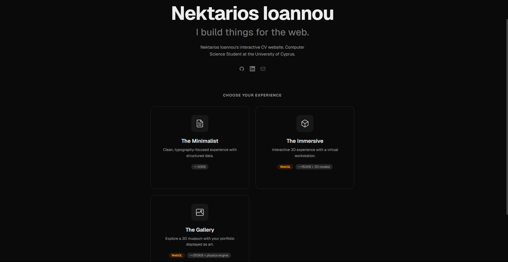
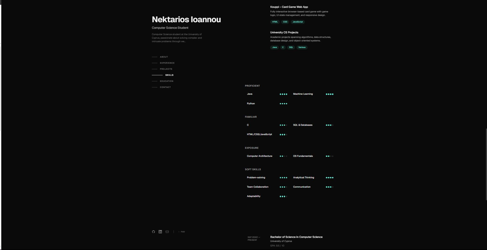
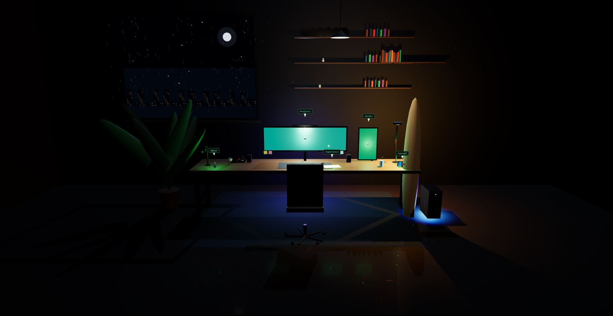
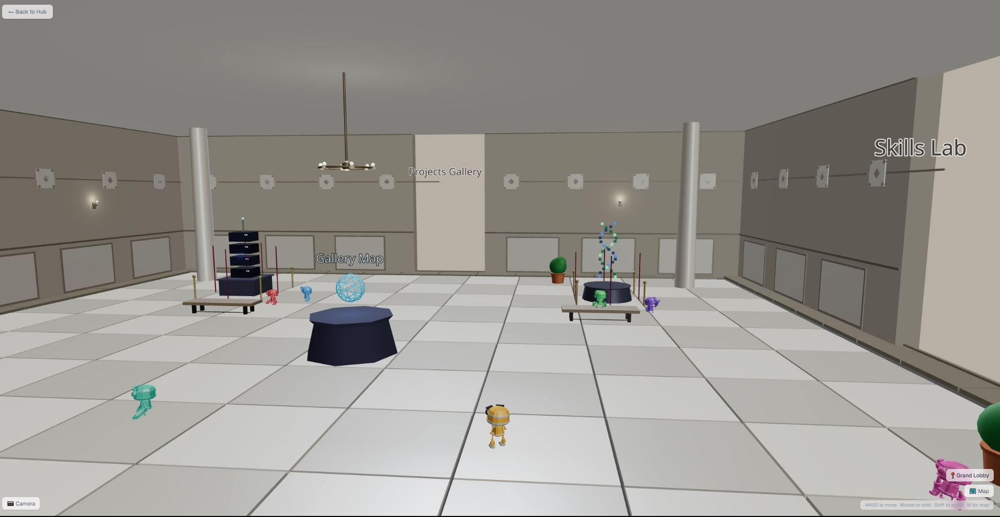
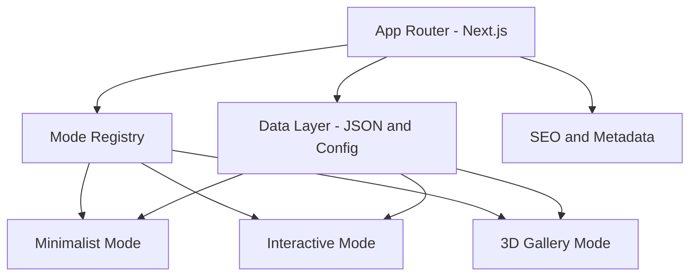

# WebsiteCV

Interactive personal CV and portfolio website built with Next.js, TypeScript, and React Three Fiber.

**Live site:** https://website-cv-rho.vercel.app

## Overview

WebsiteCV presents a professional profile through multiple UX modes, from a clean traditional CV layout to immersive 3D exploration. The goal is to combine strong engineering structure with engaging presentation.

This repository is also part of an agent-assisted learning experiment: rapid, iterative implementation ("vibe coding") combined with disciplined software practices.

## Experience Modes

### Home Hub

The home hub acts as the navigation center and entry point for all presentation modes.



### Minimalist Mode

A clean, recruiter-friendly CV view focused on readability, scannable sections, and fast access to key information.



### Interactive Mode

A richer interactive experience for exploring profile details and project content with modern motion and component-driven UI.



### Gallery Mode

An immersive 3D environment powered by React Three Fiber, designed to showcase projects and profile content in a memorable way.



## Architecture



## Tech Stack

- Next.js 16 (App Router)
- React 19
- TypeScript
- Tailwind CSS 4
- React Three Fiber / Drei / Three.js
- Zustand
- Framer Motion
- Vitest + Playwright

## Engineering Principles

- Separation of concerns across routes, modes, data, and reusable components.
- Incremental implementation in small safe milestones.
- Precision-first changes with verification after each meaningful step.
- Maintainable structure designed for extension (new modes, content sections, and visuals).

## Project Structure

```text
src/
	app/            # Routes and top-level pages
	components/     # Shared UI and feature components
	data/           # CV, projects, and skills data
	hooks/          # Reusable React hooks
	lib/            # Utilities and shared constants
	modes/          # Mode implementations (A, B, C)
	stores/         # State management
	types/          # TypeScript types
```

#  Webstite Link

https://tinyurl.com/nektarios-portfolio


## Getting Started

### Prerequisites

- Node.js 20+
- pnpm 10+

### Install and Run

```bash
pnpm install
pnpm dev
```

Open http://localhost:3000

## Scripts

```bash
pnpm dev            # Start development server
pnpm build          # Create production build
pnpm start          # Run production server
pnpm lint           # Run ESLint
pnpm type-check     # Run TypeScript checks
pnpm test           # Run unit tests in watch mode
pnpm test:run       # Run unit tests once
pnpm test:e2e       # Run Playwright end-to-end tests
```

## Deployment

Production deployment is configured via Vercel and connected to the repository.

- Production URL: https://website-cv-rho.vercel.app
- New commits to `main` trigger automatic production deploys.

## Credits

Created and maintained by Nektarios Ioannou.

Special focus of this project: blending fast creative iteration with high-quality engineering standards.
